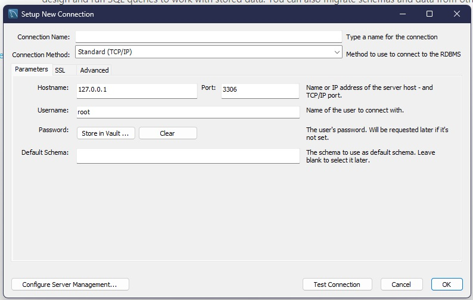
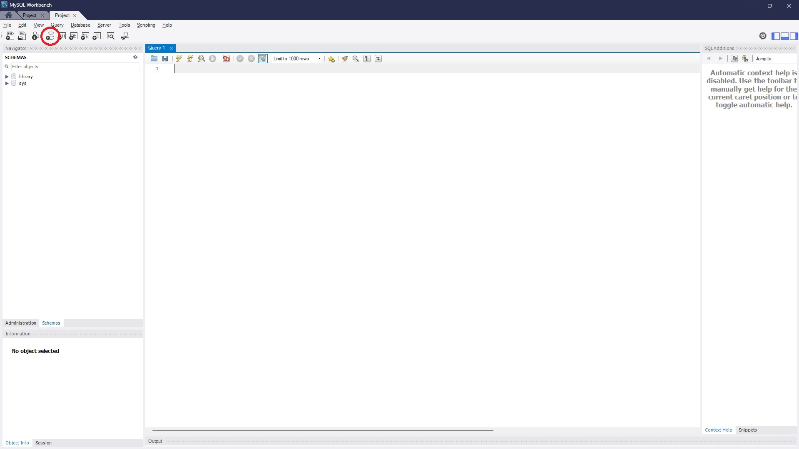
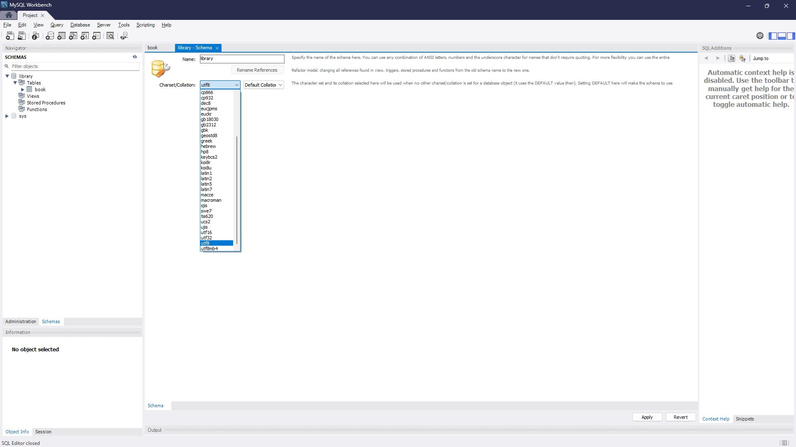

# Library

## Database
The choice of database we are using is MYSQL. Here are the steps to startup.

1. Ensure MYSQL server and MYSQL workbench is installed.
2. In this project the user accessing this is a root user.
   1. Go to your MYSQL Command Line Client
   2. Paste this command line --> "FLUSH PRIVILEGES;
ALTER USER 'root'@'localhost' IDENTIFIED BY 'newpassword';" It will be very important for your app on your side. This ensures that when you create a connection with root, it will have the privileges to do so.
3. MYSQL Workbench will where we will be creating the connection and managing the schemas and table
   1. Press the add button (+) to make new connection. It should look something like this.
   
   2. Set connection name to anything you want and leave everything as it is.
   3. Press Test Connection. If prompted for password, it is the password from 'newpassword'.
   
   5. If everything is successful, create new schema and type 'library' and set default charset to utf-8 and then continue.
   

## Python

### app.py

1. This is where you will run the code from to initialise the website.
2. This website is done by flask so its mostly routing in the backend like this.

   

   as you can see here in @app.route('/login') it handles everything for login.html. So meaning to say if you were to look up to @app.route('/'), you can handle python logic and return any data, etc back to the html file it was assigned to.
   so to get started, go to app.py and run it.

### request.py

1. This is where you will run the code from to populate json files that contain NLB library books that are in ebook or digital.
2. If you want to populate your own json file, you can change the values of "ContentType". Eg. if you choose eBooks, it will gather 100 books of each category from categories.py.
   
   
   
   these values are from the image below
   
   

### conn.py

This file will be the place to initialise our connection with our database. Change the password to the 'newpassword'.

### query.py

Query.py will contain long sql queries such that our app.py won't be so long.

## html

### base.html

### index.html

the  from base.html serves it purpose as a template for other html to use and if a html class uses , it means that it is populating it's own content with base.html.

